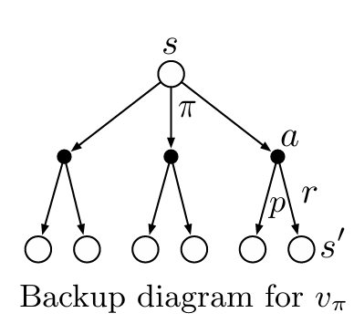
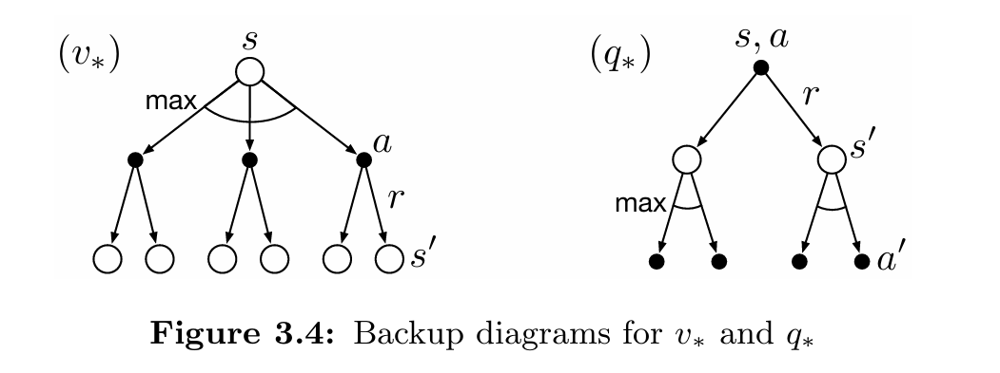

# Reinforcement_Learning_class

## Value Function Derivation in Markov Decision Process (MDP)

### 3.5 Bellman equation for vπ.

$$
\begin{align*}
v_\pi(s) &\doteq \mathbb{E}_\pi[G_t \mid S_t=s] \\
&= \mathbb{E}_\pi[R_{t+1} + \gamma G_{t+1} \mid S_t=s] \\
&= \sum_{a} \pi(a|s) \sum_{s',r} p(s',r|s,a) [r + \gamma\mathbb{E}_\pi[G_{t+1}|S_{t+1}=s']] \\
&= \sum_{a} \pi(a|s) \sum_{s',r} p(s',r|s,a) [r + \gamma v_\pi(s')], \quad \text{for all } s \in \mathcal{S},
\end{align*}
$$

#### 拆分期望：
根据期望的线性性质，我们可以将期望拆分为两部分：
$$
\mathbb{E}_\pi[R_{t+1} + \gamma G_{t+1} \mid S_t=s] = \mathbb{E}_\pi[R_{t+1} \mid S_t=s] + \gamma \mathbb{E}_\pi[G_{t+1} \mid S_t=s]
$$

这是一个很棒的问题，因为这段文字描述了从期望到求和的推导过程，而不仅仅是公式本身。以下是这段文字的 Markdown + LaTeX 格式，将公式部分嵌入到文本中：

#### 转换为求和

期望 $\mathbb{E}$ 可以通过对所有可能的未来结果进行求和来计算。这里，未来的结果是由**动作 $a$**、**下一个状态 $s'$** 和**奖励 $r$** 决定的。

1.  **对动作 $a$ 求和：** 我们首先要考虑在状态 $s$ 下，根据策略 $\pi$ 可以选择的所有可能的动作。每个动作 $a$ 发生的概率是 $\pi(a|s)$。

2.  **对下一个状态 $s'$ 和奖励 $r$ 求和：** 在采取了动作 $a$ 之后，环境会根据其动态特性，以概率 $p(s',r|s,a)$ 转移到下一个状态 $s'$ 并给出奖励 $r$。因此，我们需要对所有可能的 $(s',r)$ 组合进行求和。

3.  **计算括号内的期望：** 括号内的部分是 $R_{t+1} + \gamma G_{t+1}$。在给定了 $(s,a,s',r)$ 之后  的值就是 $r$。而 $G_{t+1}$ 是从状态 $s'$ 开始的未来收益，其期望是 $\mathbb{E}_\pi[G_{t+1} \mid S_{t+1}=s']$。

综合以上步骤，我们就得到了下一行：

$$= \sum_{a} \pi(a|s) \sum_{s',r} p(s',r|s,a) [r + \gamma\mathbb{E}_\pi[G_{t+1}|S_{t+1}=s']]$$

### 3.6 Optimal Policies and Optimal Value Functions
 Bellman optimality equation for $v_*(s)$
$$
v_*(s) \doteq \max_\pi v_\pi(s)
$$

$$
q_*(s,a) \doteq \max_\pi q_\pi(s,a)
$$
$$
q_*(s,a) = \mathbb{E}[R_{t+1} + \gamma v_*(S_{t+1}) \mid S_t=s, A_t=a]
$$
$$
\begin{align*}
v_*(s) &= \max_{a \in \mathcal{A}(s)} q_{\pi_*}(s, a) \\
&= \max_{a} \mathbb{E}_{\pi_*}[G_t \mid S_t=s, A_t=a] \\
&= \max_{a} \mathbb{E}_{\pi_*}[R_{t+1} + \gamma G_{t+1} \mid S_t=s, A_t=a] \\
&= \max_{a} \mathbb{E}[R_{t+1} + \gamma v_*(S_{t+1}) \mid S_t=s, A_t=a] \\
&= \max_{a} \sum_{s',r} p(s',r \mid s,a) [r + \gamma v_*(s')]
\end{align*}
$$

$$
\begin{align*}
q_*(s,a) &= \mathbb{E}[R_{t+1} + \gamma \max_{a'} q_*(S_{t+1}, a') \mid S_t=s, A_t=a] \\
&= \sum_{s',r} p(s',r \mid s,a) [r + \gamma \max_{a'} q_*(s',a')]
\end{align*}
$$

