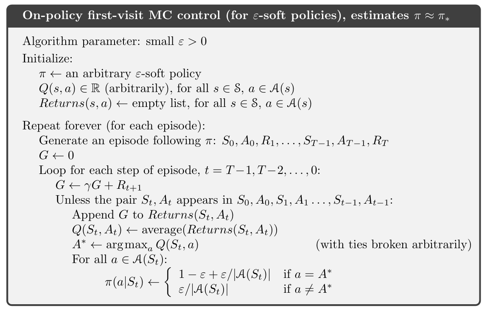

# Reinforcement_Learning_class

### Chapter 5 Monte Carlo Methods

### Prediction --  首次访问（First-visit MC） 
 

首次遍历的例子 -- 需要保存一个访问历史{s0,,,S_t-1} 的数列

让我们用你的例子来追踪一下算法的执行流程：
**剧集序列：** `S_0 -> S_1 (t=1) -> S_2 -> S_1 (t=3) -> S_3 -> S_4 (t=T-1)`

**算法的倒序循环：** `t = T-1, T-2, ..., 0`

1.  **`t=T-1`：** 状态是 `S_4`。`S_4` 不在 `{S_0, S_1, S_2, S_1, S_3}` 中。条件满足。
    * 更新 `V(S_4)`。

2.  **`t=T-2`：** 状态是 `S_3`。`S_3` 不在 `{S_0, S_1, S_2, S_1}` 中。条件满足。
    * 更新 `V(S_3)`。

3.  **`t=3`：** 状态是 `S_1`。`S_1` **在** `{S_0, S_1, S_2}` 中。条件**不满足**。
    * **跳过**这次更新，不处理 `V(S_1)`。

4.  **`t=2`：** 状态是 `S_2`。`S_2` 不在 `{S_0, S_1}` 中。条件满足。
    * 更新 `V(S_2)`。

5.  **`t=1`：** 状态是 `S_1`。`S_1` 不在 `{S_0}` 中。条件满足。
    * **更新** `V(S_1)`。
-----------
### Control --   
### 蒙特卡洛ES（Exploring Starts） 算法
 

用first visit，每次更新策略。

-----------------------------------
### 在策略 蒙特卡洛 （ε-greedy） 算法
目的：找到近似最优的策略 π≈π∗
​
 
s0可以固定，也可以随机

-----------------------------------
### 离策略 蒙特卡洛 prediction 算法

离策略 要 重要性采样 

$$\rho_{t:T-1} = \prod_{k=t}^{T-1} \frac{\pi(A_k|S_k)}{b(A_k|S_k)}$$

### 两种重要性采样方法
#### 普通重要性采样 (Ordinary Importance Sampling)

思想：对所有情节中访问过某个状态 s 的回报进行简单平均，但每个回报都乘以对应的重要性采样比率。

公式：$ V(s) \approx \frac{\sum_{\text{all episodes}} \rho_{t:T-1} G_t}{\text{count of first visits}} $

缺点：方差非常大，特别是情节越长，比率的乘积就可能变得非常大或非常小，导致估计不稳定。

#### 加权重要性采样 (Weighted Importance Sampling)

思想：使用加权平均，分母是所有重要性采样比率的和。

公式：$ V(s) \approx \frac{\sum_{\text{all episodes}} \rho_{t:T-1} G_t}{\sum_{\text{all episodes}} \rho_{t:T-1}} $

优点：方差通常比普通重要性采样小得多，在实践中更常用。虽然它是一个有偏估计（在理论上），但随着样本量的增加，其偏差会趋近于零。

 
 

 -----------------
 ## 总结

 好的，我们来系统地总结一下强化学习中的蒙特卡洛（Monte Carlo, MC）算法。

### 核心思想

蒙特卡洛算法是强化学习中的一种无模型（model-free）方法。它不依赖于环境的动态模型（即不知道状态转移概率和奖励函数），而是通过**从完整剧集（episode）中采样**来学习。

其核心思想是：**通过多次经验采样，用一个状态在剧集中获得的平均未来收益（Return）来估计该状态的价值（Value）。**

### 主要类型

MC 算法主要分为两大类：

1.  **蒙特卡洛预测（Monte Carlo Prediction）：** 估计给定策略 $\pi$ 下的价值函数 $v_\pi$。
    * **目标：** 计算每个状态在策略 $\pi$ 下的平均价值。
    * **工作方式：**
        1.  遵循策略 $\pi$，生成一个完整的剧集。
        2.  对于剧集中访问到的每一个状态 $s_t$，计算其未来收益 $G_t$（从 $s_t$ 开始到剧集结束的所有折扣奖励之和）。
        3.  将 $G_t$ 添加到 $s_t$ 的收益列表中。
        4.  $s_t$ 的价值 $v_\pi(s_t)$ 通过对所有收集到的收益取平均来更新。
    * **子类型：**
        * **首次访问（First-visit MC）：** 在一个剧集中，只使用状态**第一次**被访问时的收益来更新其价值。
        * **每次访问（Every-visit MC）：** 在一个剧集中，每次状态被访问时，都用其对应的收益来更新其价值。
    * **用途：** 用于**策略评估**。

2.  **蒙特卡洛控制（Monte Carlo Control）：** 寻找最优策略 $\pi_*$。
    * **目标：** 找到一个能最大化未来收益的最优策略。
    * **工作方式：** 采用**广义策略迭代（Generalized Policy Iteration, GPI）**思想，包含两个交替进行的步骤：
        * **策略评估（Policy Evaluation）：** 使用蒙特卡洛方法（如上述的MC预测）来评估当前策略 $\pi_k$ 的行为价值函数 $q_{\pi_k}(s,a)$。
        * **策略改进（Policy Improvement）：** 根据评估出的行为价值函数，贪婪地选择动作来生成一个新的、改进的策略 $\pi_{k+1}$。
    * **核心挑战：** 蒙特卡洛控制需要探索所有可能的行为，但纯粹的贪婪策略无法保证探索。因此，需要引入**探索性启动（Exploring Starts）**或**ε-贪婪（ε-greedy）**等技术来保证所有状态-动作对都能被访问到。

### 优点与缺点

| 优点 (Advantages)                               | 缺点 (Disadvantages)                            |
| ----------------------------------------------- | ----------------------------------------------- |
| **无模型（Model-free）**：不需要知道环境的动态模型，可以直接从经验中学习。 | **高方差（High Variance）**：一个剧集的未来收益可能与另一个剧集差异很大，导致估计的价值方差较大。 |
| **直接从经验中学习**：特别适合于那些无法建立精确模型，但可以进行采样的复杂环境。 | **无法在线学习**：必须等到一个完整的剧集结束才能进行更新，不适用于持续性任务。 |
| **适用于非马尔可夫任务**：因为它不需要依赖于马尔可夫性，只要剧集有明确的开始和结束即可。 | **低效**：为了获得准确的价值估计，通常需要大量的剧集样本。 |
| **无需自举（bootstrapping）**：它不使用其他价值估计来更新当前价值，因此没有自举带来的潜在误差（如贝尔曼方程中的误差累积）。 | **探索的挑战**：需要额外的机制（如ε-贪婪）来确保充分探索，这可能会影响学习效率。 |

### 与其他算法的比较

* **与动态规划（DP）的区别：**
    * **MC：** 无模型，从经验中学习，需要完整剧集。
    * **DP：** 需要环境的完整模型，通过迭代贝尔曼方程进行计算，无需真实交互。
* **与时序差分（TD）的区别：**
    * **MC：** 无模型，基于完整剧集，无自举，更新方差大。
    * **TD：** 无模型，可以在每一步进行更新（在线学习），基于自举，更新方差小。

### 总结

蒙特卡洛算法是强化学习的基石之一，它通过对完整剧集的采样来解决无模型下的学习问题。尽管它在效率和方差上存在一些局限性，但其直观、简单的思想为后续的TD等更高效算法奠定了基础，特别是在某些无法建立环境模型的复杂场景中，MC算法仍然是重要的解决方案。