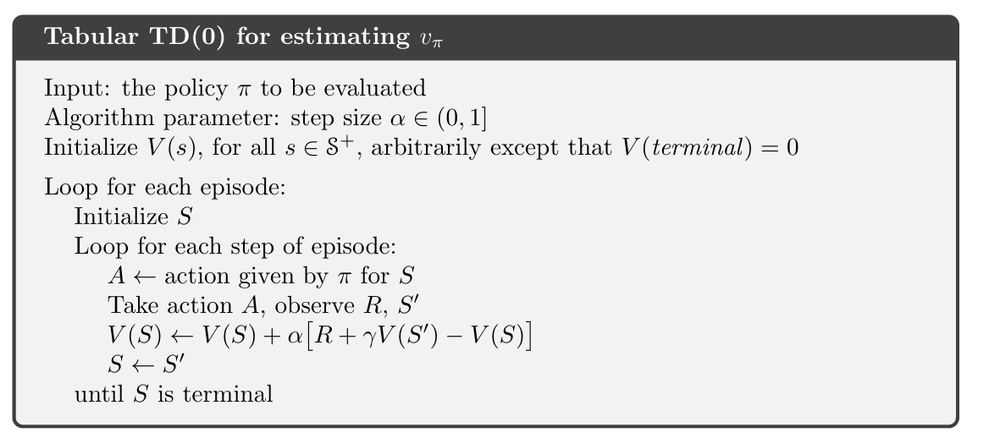
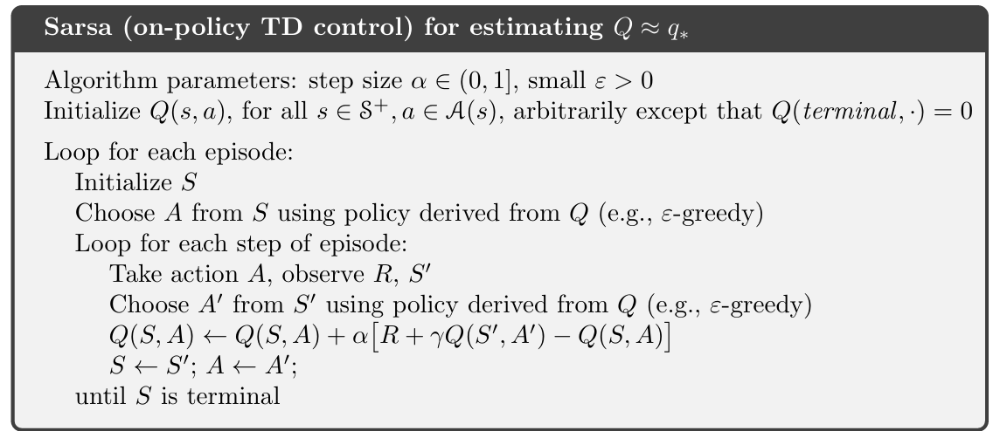
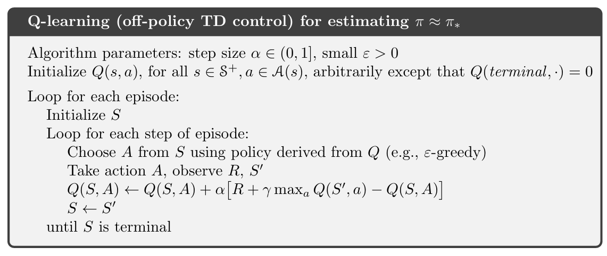

# Reinforcement_Learning_class

### Chapter 6  Temporal-Di↵erence Learning


### TD（0） --  estimate state value

 

TD误差
$$ \delta_{t} \doteq R_{t+1}+\gamma V\left(S_{t+1}\right)-V\left(S_{t}\right) $$

---------------------------------

 

---------------------------------

 


----------------------------------------
 SARSA、Q-Learning 和 TD 都是强化学习中非常重要的无模型（model-free）控制算法，它们都属于**时序差分（Temporal-Difference, TD）学习**的范畴。

让我们来理清它们之间的关系：

### 核心概念：时序差分（TD）

首先，需要理解 TD 学习的核心思想。

  * **蒙特卡洛（MC）**：需要等待一个剧集结束，然后用**实际的未来收益**（$G\_t$）来更新价值。
  * **动态规划（DP）**：需要环境模型，用**下一个状态的估计价值**来更新当前价值。
  * **时序差分（TD）**：结合了 MC 和 DP 的优点。它**不需要环境模型**，并且**不需要等待剧集结束**。它在每一步（或每几步）更新价值，用**下一个状态的估计价值**来更新当前价值。

TD 学习的更新公式通常是：
$$V(s_t) \leftarrow V(s_t) + \alpha [R_{t+1} + \gamma V(s_{t+1}) - V(s_t)]$$
这里的 $[R\_{t+1} + \\gamma V(s\_{t+1}) - V(s\_t)]$ 就是**TD 误差**（TD Error）。

### 关系图

我们可以用一个简单的图来表示它们之间的关系：

```
       强化学习
          |
  -------------------
  |                   |
无模型(Model-free)  有模型(Model-based)
   |                  |
MC学习 ---------- TD学习
 (基于实际收益)   (基于估计收益)
       |
  --------------------
  |                    |
 SARSA ----------- Q-Learning
 (On-policy)        (Off-policy)
```

### SARSA 与 Q-Learning：都是 TD 控制算法

SARSA 和 Q-Learning 的共同点在于：它们都使用 TD 方法来解决**控制问题**，即学习一个最优的**行为价值函数** $q(s, a)$，而不是状态价值函数 $v(s)$。

行为价值函数 $q(s, a)$ 表示在状态 $s$ 下采取动作 $a$ 的价值。一旦我们有了这个函数，我们就可以通过简单地选择价值最大的动作来获得一个好的策略。

### 关键区别：On-policy vs. Off-policy

SARSA 和 Q-Learning 之间的根本区别在于它们的**策略类型**：

#### 1\. SARSA (On-policy TD Control)

  * **名称由来：** SARSA 得名于它的五个元组：**S**tate, **A**ction, **R**eward, next **S**tate, next **A**ction。
  * **核心思想：** SARSA 是一种 **on-policy**（同策略）算法。它使用**当前策略**（如 ε-贪婪策略）来**选择**和**评估**动作。
  * **更新公式：**
    $$q(s_t, a_t) \leftarrow q(s_t, a_t) + \alpha [R_{t+1} + \gamma q(S_{t+1}, A_{t+1}) - q(s_t, a_t)]$$
      * **$A\_{t+1}$ 是通过**当前策略**选择的下一个实际要执行的动作**。
  * **优点：** 学习过程更稳定，因为它考虑了**实际执行的下一个动作**。这使其在学习过程中更安全，能避免在某些环境中采取灾难性的动作（例如，在悬崖行走问题中，SARSA 会更倾向于走远离悬崖的路径）。
  * **缺点：** 学习的是一个**次优**（sub-optimal）策略，因为它包含了探索（ε-贪婪）的成分。

#### 2\. Q-Learning (Off-policy TD Control)

  * **名称由来：** Q-Learning 直接学习最优的行为价值函数 $q\_\*$。
  * **核心思想：** Q-Learning 是一种 **off-policy**（异策略）算法。它使用**两种不同的策略**：
      * **行为策略 (Behavior Policy)：** 用于选择实际要执行的动作，通常是 ε-贪婪策略，以保证探索。
      * **目标策略 (Target Policy)：** 用于更新价值函数，总是**贪婪策略**，即选择能带来最大未来价值的动作。
  * **更新公式：**
    $$q(s_t, a_t) \leftarrow q(s_t, a_t) + \alpha [R_{t+1} + \gamma \max_{a'} q(S_{t+1}, a') - q(s_t, a_t)]$$
      * 这里的 $\\max\_{a'} q(S\_{t+1}, a')$ 是**下一个状态 $S\_{t+1}$ 中所有可能动作的最大 Q 值**，它代表了最优的未来价值。
  * **优点：** 学习的是**最优**（optimal）策略，因为它始终朝着能带来最大价值的方向更新。
  * **缺点：** 学习过程可能不稳定，尤其是在与函数逼近结合时。它不考虑行为策略的探索行为，直接用最优值来更新，可能导致在某些环境下学习到次优甚至危险的策略。

### 总结表格

| 特性          | SARSA                                        | Q-Learning                                   |
| :------------ | :------------------------------------------- | :------------------------------------------- |
| **类型** | On-policy (同策略)                           | Off-policy (异策略)                          |
| **更新目标** | 学习在探索下的最优价值                       | 学习最优价值                                 |
| **下一个 Q** | $q(S\_{t+1}, A\_{t+1})$                        | $\\max\_{a'} q(S\_{t+1}, a')$                   |
| **$A\_{t+1}$ 的选择** | **实际执行的动作**（由行为策略选择）        | **理论上能带来最大价值的动作**（贪婪选择）   |
| **学习结果** | 探索下的次优策略                             | 最优策略                                     |
| **适用场景** | 机器人、自动驾驶等需要考虑安全性的环境       | 游戏、棋盘游戏等可以承担试错风险的环境       |

总而言之，SARSA、Q-Learning 都是 TD 学习大家族中的成员，它们都使用 TD 误差来更新价值函数。它们之间的核心区别在于**如何选择用于计算 TD 误差的“下一个”价值**：SARSA 选择了**实际执行的下一个动作的价值**，而 Q-Learning 则选择了**理论上能达到的最大价值**。