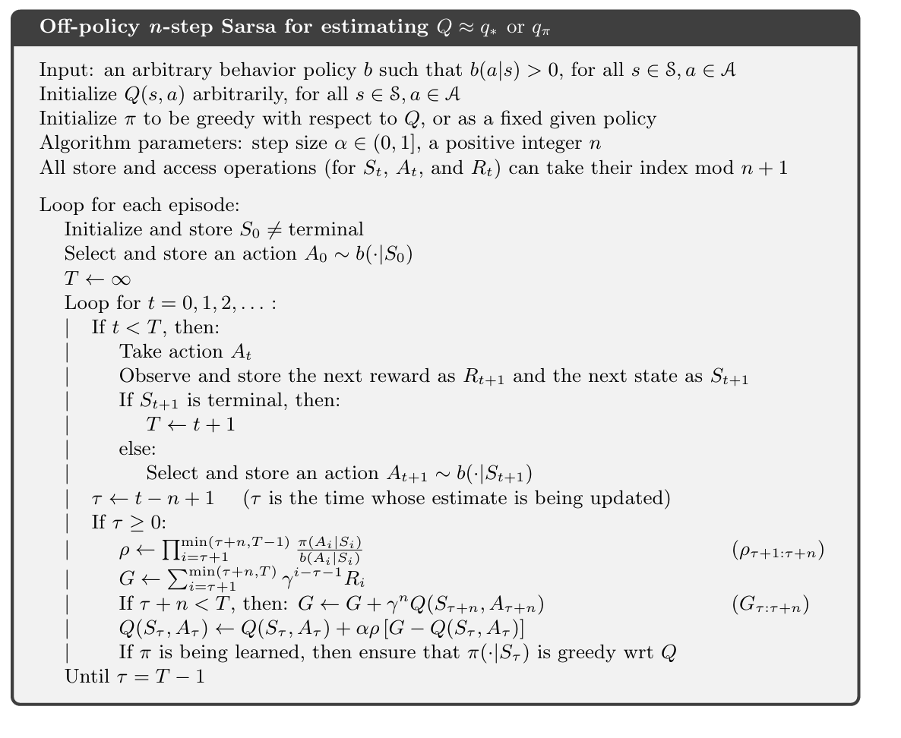

# Reinforcement_Learning_class

### Chapter 7 n-step Bootstrapping

### n-step Bootstrapping (n 步自举法) 介绍

#### 1. n 步收益 (n-step Return)

n 步自举法的核心是**n 步收益**（n-step Return），其定义是：

$$G_t^{(n)} = R_{t+1} + \gamma R_{t+2} + \dots + \gamma^{n-1} R_{t+n} + \gamma^n V_{t+n}(S_{t+n})$$

* $R_{t+1}, R_{t+2}, \dots, R_{t+n}$：从时间步 $t$ 开始，实际观察到的 $n$ 个奖励。
* $\gamma^n V_{t+n}(S_{t+n})$：第 $n$ 步之后，用**估计的价值函数** $V_{t+n}$ 来代替剩下的真实收益。这就是**自举（Bootstrapping）**的部分。

可以这样理解：我们实际走了 $n$ 步，得到了真实的奖励，然后对第 $n$ 步之后的所有未来奖励，我们用一个**估计值**来代替。

* 当 $n=1$ 时，这就是标准的 TD(0) 收益：
    $$G_t^{(1)} = R_{t+1} + \gamma V(S_{t+1})$$
* 当 $n=\infty$ 时，这就是标准的蒙特卡洛收益：
    $$G_t^{(\infty)} = R_{t+1} + \gamma R_{t+2} + \dots + \gamma^{T-t-1} R_T$$
    （这里 $T$ 是剧集结束的时间步，`$V(S_T)` 为 0）。

#### 2. n 步 TD 学习算法

使用 n 步收益，我们可以得到 n 步 TD 算法的更新规则：

$$V(S_t) \leftarrow V(S_t) + \alpha [G_t^{(n)} - V(S_t)]$$

其中 $G_t^{(n)}$ 就是上面定义的 n 步收益。

 

TD 用来学V，sarsa 用来学Q
#### HW4 coding -- 要注意循环的次数

 

Offline 需要重要性采样

#### 4. 优缺点与应用场景

| 优点                                            | 缺点                                        |
| ----------------------------------------------- | ------------------------------------------- |
| **方差和偏差的平衡**：随着 $n$ 值的增加，n 步自举法的方差逐渐接近 MC，偏差逐渐减小；随着 $n$ 值的减小，方差减小，偏差增大。我们可以通过调整 $n$ 来达到最佳平衡。 | **需要存储**：为了计算 n 步收益，算法需要存储最近 $n$ 步的状态和奖励，这增加了计算和内存的开销。 |
| **灵活性**：它允许我们根据具体问题的特性来选择合适的 $n$ 值。对于某些问题，短期的自举（小 $n$）更有效，而对于另一些问题，长期的自举（大 $n$）更好。 | **参数选择**：如何选择最优的 $n$ 值是一个超参数调优问题，需要经验或额外的方法来确定。 |
| **更强的泛化能力**：由于结合了两种方法的优点，n 步自举法在许多任务中表现优于纯粹的 MC 或 TD(0)。 |                                             |

#### 5. 与 TD($\lambda$) 的关系

n 步自举法可以看作是更通用的 **TD($\lambda$) 算法**的一个特例。

* **TD($\lambda$)** 是一种**加权平均**方法，它将所有可能的 n 步收益（从 n=1 到 n=T-t）都进行加权求和，其中权重由一个衰减参数 $\lambda$ 决定。
* n 步自举法只考虑一个固定的 n，而 TD($\lambda$) 则可以同时利用所有 n-step return。

因此，n 步自举法是理解 TD($\lambda$) 算法的重要基础。在实际应用中，TD($\lambda$) 通常比固定的 n-step 算法更优，因为它能更好地利用所有的历史信息。

总而言之，n 步自举法是一种**在 MC 和 TD(0) 之间进行权衡**的重要方法，它通过选择一个合适的 n，来平衡**更新的及时性**和**估计的准确性**。