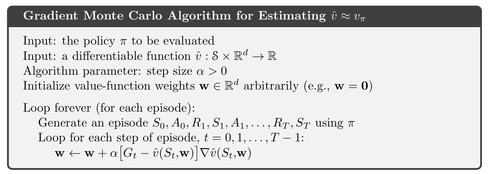
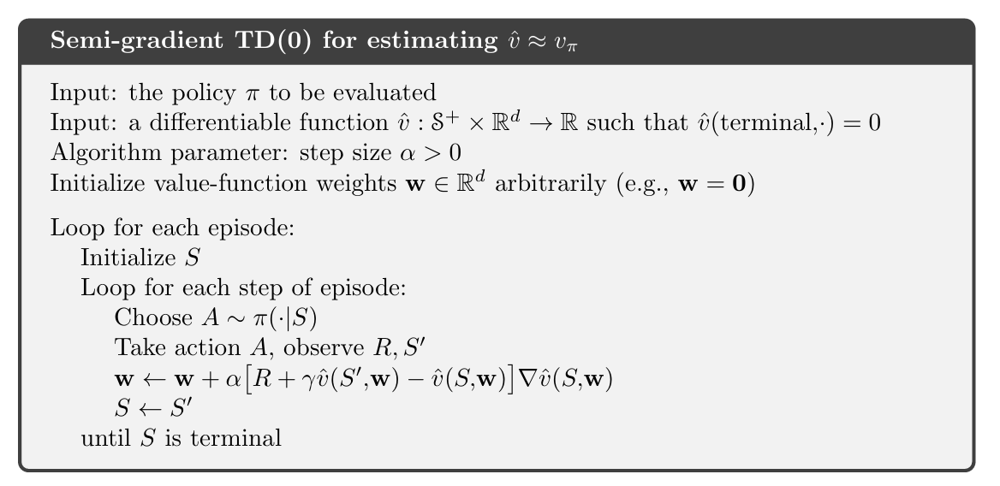

# Reinforcement_Learning_class

### Chapter 9

#### **3. 均方误差（VE）：预测目标函数**
为了衡量价值函数的近似质量，定义**均方误差（VE, Mean-Square Error）**：
$$
\overline{VE}(w) = \sum_{s \in S} \mu(s) \left[ v_{\pi}(s) - \hat{v}(s, w) \right]^2
$$
-------------------------
好的！我们将详细探讨 **随机梯度下降（SGD）** 和 **半梯度方法（Semi-Gradient Methods）** 在 **价值函数近似（Value Function Approximation, VFA）** 中的应用。这类方法在强化学习中至关重要，尤其是在处理大规模状态空间时，通过参数化函数（如线性模型、神经网络）逼近真实价值函数。

---

### **2. 随机梯度下降（SGD）**
## 更新规则 (Update Rule)

对于每个观察到的样本（状态 $s$ 和目标值 $v_\pi(s)$），调整参数 $\mathbf{w}$ 以减小近似误差：

$\mathbf{w} \leftarrow \mathbf{w} - \alpha \nabla_{\mathbf{w}} \left[ \hat{v}(s, \mathbf{w}) - v_\pi(s) \right]^2$

其中：
- $\alpha$ 是学习率。
- 梯度方向为：$\nabla_{\mathbf{w}} \left[ \hat{v}(s, \mathbf{w}) - v_\pi(s) \right]^2 = 2 \left( \hat{v}(s, \mathbf{w}) - v_\pi(s) \right) \nabla_{\mathbf{w}} \hat{v}(s, \mathbf{w})$。

因此，更新规则可以简化为：

$\mathbf{w} \leftarrow \mathbf{w} - \alpha \left( \hat{v}(s, \mathbf{w}) - v_\pi(s) \right) \nabla_{\mathbf{w}} \hat{v}(s, \mathbf{w})$

#### **特点**
- **在线学习**：每次用一个样本更新，适用于非平稳环境。
- **无偏更新**：若 \(v_\pi(s)\) 是真实值，SGD收敛到局部最优。

---

### **3. 半梯度方法（Semi-Gradient Methods）**
## 核心问题 (Core Problem)

在强化学习中，目标值 ($v_\pi(s)$) 通常依赖于当前的近似值（如自举的 TD 目标），这导致目标本身是参数 ($\mathbf{w}$) 的函数。例如：

* **TD(0) 目标**: $v_\pi(s) \approx r + \gamma \hat{v}(s', \mathbf{w})$
* **Q-learning 目标**: $q_\pi(s,a) \approx r + \gamma \max_{a'} \hat{q}(s',a', \mathbf{w})$

此时，完整的梯度更新应该包含对目标的梯度，但实际中常忽略这一部分，这种方法被称为 **半梯度更新 (Semi-Gradient Update)**。

## 半梯度更新规则 (Semi-Gradient Update Rule)

以半梯度 TD(0) 为例：

$\mathbf{w} \leftarrow \mathbf{w} + \alpha \left[ r + \gamma \hat{v}(s', \mathbf{w}) - \hat{v}(s, \mathbf{w}) \right] \nabla_{\mathbf{w}} \hat{v}(s, \mathbf{w})$

**关键区别**:

半梯度更新仅对预测值 $\hat{v}(s, \mathbf{w})$ 求梯度，而忽略了目标 $r + \gamma \hat{v}(s', \mathbf{w})$ 对参数 $\mathbf{w}$ 的依赖。

这在实践中是一个重要的简化。尽管它不是一个严格意义上的梯度下降（因为它没有沿着真实误差梯度的方向移动），但在大多数情况下，半梯度方法是有效的并且是首选的。它在计算上更简单，并且在函数逼近器使用线性模型时能够保证收敛。对于非线性函数逼近器（如神经网络），尽管收敛性没有理论保证，但它仍然是当前最主流的更新方式。

#### **为什么用半梯度？**
1. **计算简便**：避免计算目标的梯度（可能复杂或不稳定）。
2. **实际效果**：尽管理论收敛性受限，但在实践中表现良好（如线性近似下仍收敛）。

---

### **5. 收敛性分析**
| 方法                | 近似类型       | 收敛性                     |
|---------------------|---------------|----------------------------|
| 随机梯度下降（SGD） | 线性/非线性   | 收敛到局部最优（无偏）      |
| 半梯度TD(0)         | 线性          | 收敛到TD固定点             |
| 半梯度Q-learning    | 线性          | 收敛（但需满足 Robbins-Monro 条件） |
| 非线性近似          | 神经网络      | 可能发散（需技巧如目标网络） |

---

### **6. 关键问题与改进**
#### **问题1：自举引入偏差**
- **原因**：TD目标依赖当前估计值，导致半梯度方法可能有偏。
- **改进**：  
  - 使用 **目标网络**（如DQN）：冻结目标网络的参数，定期更新。  
  - 资格迹（TD(λ)）：平衡MC和TD的偏差-方差权衡。

#### **问题2：非平稳性**
- **原因**：策略改进和数据分布变化导致目标不稳定。
- **改进**：  
  - 经验回放（Experience Replay）：打破样本相关性。  
  - 双Q学习（Double Q-learning）：减少最大化偏差。

---

 

 

### HW5 coding

 

9.5.4 Tile Coding

 