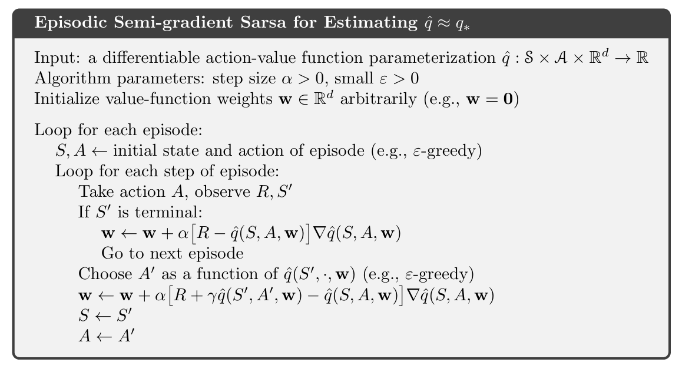
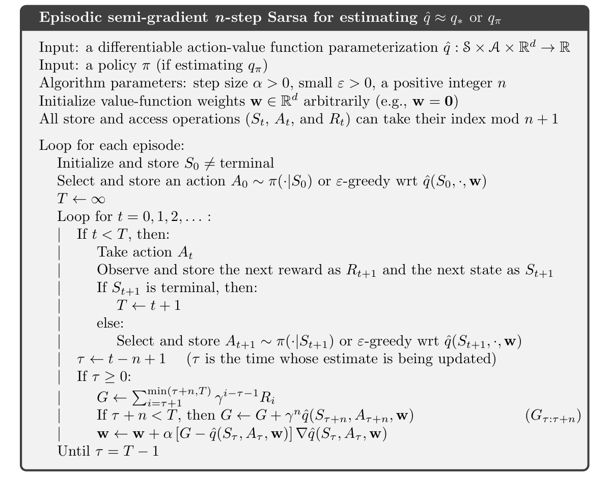
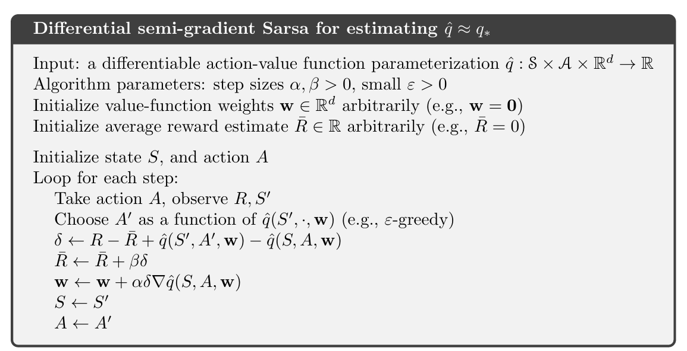
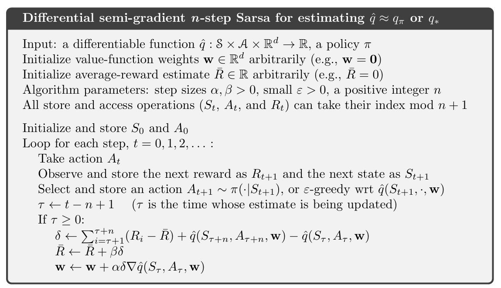

# Reinforcement_Learning_class

### Chapter 10

$$\mathbf{w}_{t+1} \doteq \mathbf{w}_t + \alpha \left[ U_t - \hat{q}(S_t, A_t, \mathbf{w}_t) \right] \nabla_{\mathbf{w}_t} \hat{q}(S_t, A_t, \mathbf{w}_t)$$

 update for the one-step Sarsa

$$\mathbf{w}_{t+1} \doteq \mathbf{w}_t + \alpha \left[ R_{t+1} + \gamma \hat{q}(S_{t+1}, A_{t+1}, \mathbf{w}_t) - \hat{q}(S_t, A_t, \mathbf{w}_t) \right] \nabla_{\mathbf{w}_t} \hat{q}(S_t, A_t, \mathbf{w}_t)$$

 

 

平均奖励：持续任务的新问题设置

 

 

-------
好的，我来解释一下“差分半梯度N步SARSA”这个概念。这是一个结合了多个强化学习思想的算法，让我们一步步拆解它。

### 1. 差分（Differential）

在传统的强化学习中，我们通常假设任务有开始和结束，并且每个时间步的奖励都是有折扣的。然而，在**连续任务**（continuing tasks）中，比如一个机器人不停地走路，没有终止状态，这种折扣化的方法就不太适用了。

**差分方法**就是专门为这类连续任务设计的。它不是最大化**总回报**（Total Return），而是最大化**平均回报**（Average Reward）。

* **平均回报** $\bar{R}$：智能体在整个过程中每一步所获得的平均奖励。
* **差分奖励** $\delta_t$：一个时间步的即时奖励与平均回报之差。
    $\delta_t = R_t - \bar{R}$
    这个差分奖励衡量了当前时间步的奖励“好于”还是“差于”平均水平。
* **TD 误差**：传统的 TD 误差是 $R_{t+1} + \gamma V(S_{t+1}) - V(S_t)$。在差分方法中，TD 误差被重新定义为：
    $\delta_t = R_t - \bar{R} + V(S_t) - V(S_{t-1})$
    或者，对于 Q-学习来说：
    $\delta_t = R_t - \bar{R} + \max_{a} Q(S_t, a) - Q(S_{t-1}, A_{t-1})$

### 2. 半梯度（Semi-Gradient）

这部分我们之前已经讨论过。在函数逼近的背景下，TD 目标（如 $R_{t+1} + \gamma V(S_{t+1})$）本身依赖于当前的权重 $\mathbf{w}$。

* **全梯度**：会同时对预测值 $\hat{v}(S_t, \mathbf{w})$ 和目标值 $R_{t+1} + \gamma \hat{v}(S_{t+1}, \mathbf{w})$ 求导。这在实践中很复杂，而且对于非线性逼近器可能导致不稳定。
* **半梯度**：**只对预测值 $\hat{v}(S_t, \mathbf{w})$ 求导，忽略目标值对 $\mathbf{w}$ 的依赖**。这种方法在计算上更简单，并且在许多情况下表现良好，尤其是在线性函数逼近中。

### 3. N步 SARSA（N-step SARSA）

这是 SARSA 的扩展，它结合了蒙特卡洛和单步 TD 的优点。

* **1步 SARSA**：使用一步真实奖励和下一步的价值估计来更新当前状态的价值。
    $Q(S_t, A_t) \leftarrow Q(S_t, A_t) + \alpha [R_{t+1} + \gamma Q(S_{t+1}, A_{t+1}) - Q(S_t, A_t)]$
* **N步 SARSA**：使用N步真实奖励和第N步之后的价值估计来更新当前状态的价值。
    * **N步回报** $G_t^{(n)}$：
        $G_t^{(n)} = R_{t+1} + \gamma R_{t+2} + ... + \gamma^{n-1}R_{t+n} + \gamma^n Q(S_{t+n}, A_{t+n})$
    * **更新公式**：
        $Q(S_t, A_t) \leftarrow Q(S_t, A_t) + \alpha [G_t^{(n)} - Q(S_t, A_t)]$

N步方法平衡了偏差和方差：N越大，偏差越小，但方差越大；N越小，偏差越大，但方差越小。

### 差分半梯度N步SARSA 结合

现在，我们将这三个概念结合起来。这个算法的目标是在**连续任务**（差分）中使用**N步经验**（N-step）来更新一个**函数逼近器**（半梯度）。

* **更新目标**：它不再是 $G_t^{(n)}$，而是**N步差分回报**。
    $G_t^{(n)} = R_{t+1} - \bar{R} + (R_{t+2} - \bar{R}) + ... + (R_{t+n} - \bar{R}) + \hat{v}(S_{t+n}, \mathbf{w})$

* **TD 误差**：$[G_t^{(n)} - \hat{v}(S_t, \mathbf{w})]$

* **半梯度更新公式**：
    $\mathbf{w} \leftarrow \mathbf{w} + \alpha [G_t^{(n)} - \hat{v}(S_t, \mathbf{w})] \nabla_{\mathbf{w}} \hat{v}(S_t, \mathbf{w})$

* **平均回报的更新**：由于平均回报 $\bar{R}$ 也是一个需要学习的参数，它也有自己的更新规则。
    $\bar{R} \leftarrow \bar{R} + \beta [G_t^{(n)} - \hat{v}(S_t, \mathbf{w})]$
    其中 $\beta$ 是平均回报的学习率。

**这个算法的特点是：**
1.  **处理连续任务**：通过差分奖励和学习平均回报，它能够稳定地在没有终止状态的环境中学习。
2.  **平衡学习**：通过 N 步回报，它能够平衡蒙特卡洛（N趋近于无穷大）和单步 TD（N=1）的优点。
3.  **使用函数逼近**：通过半梯度方法，它能够处理巨大的或连续的状态空间。

这种方法在实践中非常重要，特别是在机器人控制等需要长期运行且没有明确终止的领域。

------------------------
您上传的图片中显示了平均回报（Average Reward）的公式，这通常用于连续性任务（Continuing Tasks），即没有终点、一直在运行的马尔可夫决策过程（MDPs）。

### 平均回报公式

根据您提供的图片（`image_d72334.png`），平均回报 $r(\pi)$ 的公式为：

$r(\pi) = \sum_s \mu_\pi(s) \sum_a \pi(a|s) \sum_{s',r} p(s', r | s, a)r$

这个公式在 MDP 满足**遍历性假设（ergodicity assumption）**时成立。遍历性假设指的是，无论从哪个状态开始，智能体最终都能以非零概率到达任何其他状态，并且所有状态都会被无限次地访问。

### 公式分解和解释

让我们来分解这个公式的每个部分，以更好地理解其含义：

* **$r(\pi)$**: 这是由策略 $\pi$ 产生的平均回报（或平均奖励）。它代表了在遵循策略 $\pi$ 的长期运行中，智能体在每个时间步平均能获得的奖励。

* **$\sum_s \mu_\pi(s)$**:
    * $\mu_\pi(s)$ 是**策略 $\pi$ 下的稳态分布（stationary distribution）**。
    * 它表示在遵循策略 $\pi$ 足够长的时间后，智能体处于状态 $s$ 的概率。
    * $\sum_s \mu_\pi(s)$ 表示对所有状态的稳态概率求和。

* **$\sum_a \pi(a|s)$**:
    * $\pi(a|s)$ 是**策略 $\pi$**，它表示在状态 $s$ 下采取动作 $a$ 的概率。
    * 这个求和表示在给定状态 $s$ 下，对所有可能的动作 $a$ 的概率求和。

* **$\sum_{s',r} p(s', r | s, a)r$**:
    * $p(s', r | s, a)$ 是**MDP 的转移概率函数**。它表示在状态 $s$ 采取动作 $a$ 后，转移到下一个状态 $s'$ 并获得奖励 $r$ 的概率。
    * $r$ 是这个转移所获得的奖励。
    * 这个求和表示对所有可能的下一个状态 $s'$ 和奖励 $r$ 求和，并乘以相应的奖励值。
    * 这一项实际上就是从状态 $s$ 采取动作 $a$ 得到的**即时奖励的期望值**。

### 整个公式的含义

将这些部分结合起来，这个公式的含义是：

1.  **对于每一个状态 $s$**，找到它在稳态分布下的概率 $\mu_\pi(s)$。
2.  **在每一个状态 $s$**，根据策略 $\pi(a|s)$，找到所有动作的概率。
3.  **对于每一个 (s, a) 对**，计算其对应的**即时奖励期望**。
4.  最后，将所有这些期望值，按照它们发生的概率（即 $\mu_\pi(s)$ 和 $\pi(a|s)$），进行加权求和。

简单来说，这个公式计算了在长期运行中，智能体在每个时间步所能获得的**平均期望奖励**。